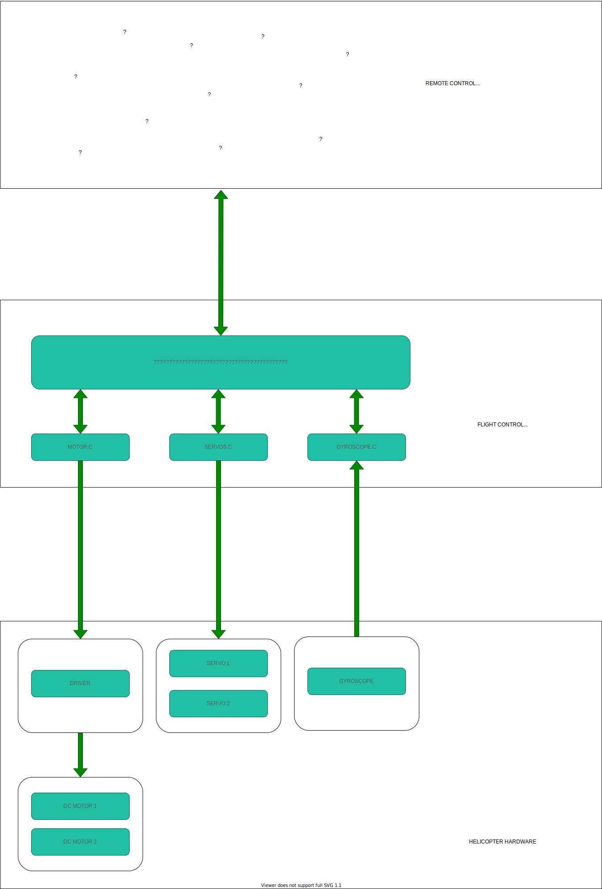

# Picopter
This project was designed to revive and make more cooler to an RC helicopter which, after a tragic accident, all the electronics were destroyed. For this, in addition to the plastic structure of the RC helicopter we will use a Raspberry Pi Zero W, 3 servos, 2 motors and a gyroscope sensor, more components will be added over time.

# Hardware
* Under construction.

# Software
The developed software is divided into flightcontrol and remotecontrol, the first works on the Raspberry Pi Zero W that is onboard the helicopter and is used to orchestrate the different parts like servors, engines and gyroscope to keep the aircraft under control and the remotecontrol is used to send orders to the helicopter.

Below you can observe the flow of hardware and software, how they interact with each other:

# Software - Remote Control
* Under construction.

# Software - Flight Control
To control pins of the Raspberry Pi Zero W, we will use [The Pigpio Library](https://abyz.me.uk/rpi/pigpio/index.html).